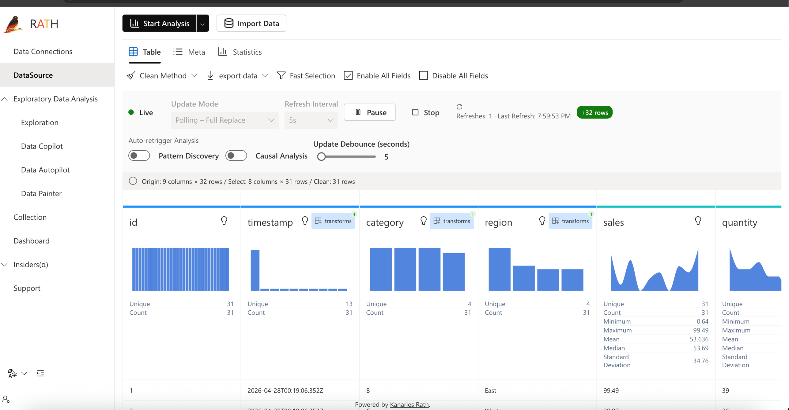
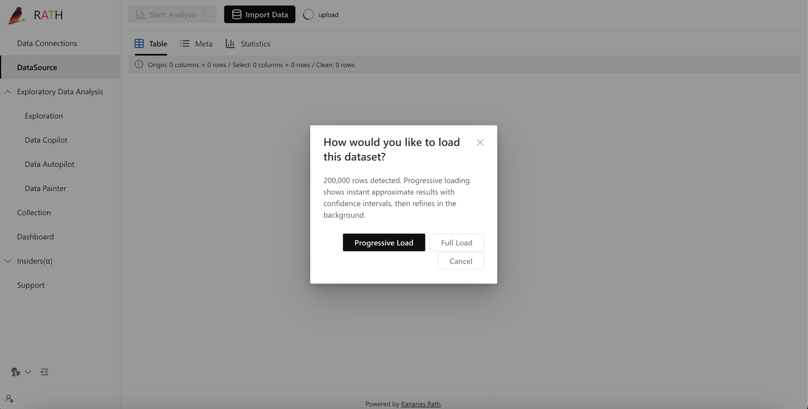
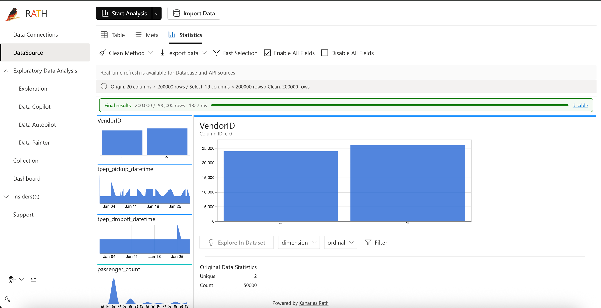
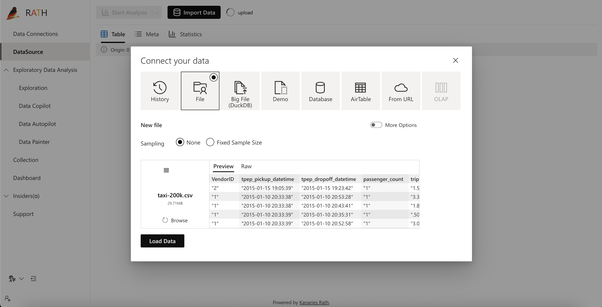
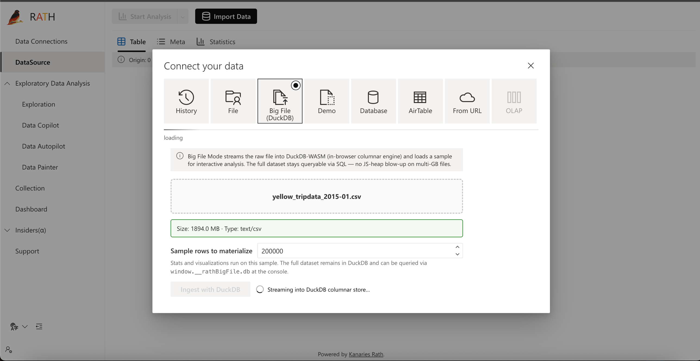
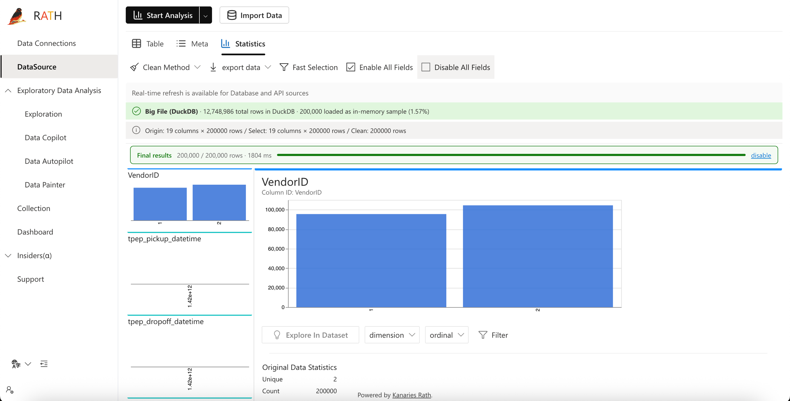

# Enhanced RATH — Analytical Framework

An enhanced fork of [Kanaries Rath](https://github.com/Kanaries/Rath), an open-source augmented analytics tool (a Tableau / Power BI alternative). This fork adds three features that close real gaps for working data analysts: **live data ingestion**, a **progressive analytics engine with confidence intervals**, and a **DuckDB-WASM big-file mode** that handles multi-gigabyte datasets in the browser.

---

## Why this fork?

Stock Rath is excellent for static, in-memory exploration but breaks down on three fronts that matter in production:

| Limitation in upstream Rath | What an analyst actually needs |
|---|---|
| Only static CSV / JSON imports — frozen once loaded | Live data: monitoring feeds, IoT, sales streams |
| Computes every statistic on the full dataset before showing anything → 30 s blank screens on large files | Instant approximate answers that refine as more data is processed |
| Crashes on files larger than ~200 K rows / ~30 MB (JS-heap exhaustion) | Multi-GB datasets without leaving the browser |

This fork addresses all three.

---

## Feature 1 — Real-Time Data Streaming

Live ingestion via HTTP polling against any REST endpoint, with automatic deduplication and resilient reconnects.

**How it works:**
- Polls the configured endpoint at a user-defined interval (e.g. every 2 s).
- Each request includes a **cursor** (`?after=<lastRowId>`) so the server only returns rows newer than the last seen — no duplicates, even after retries.
- An RxJS pipeline auto-retries failed polls with exponential backoff (1 s → 2 s → 4 s → 8 s) and surfaces persistent errors in the UI.
- A **+N rows** badge and pulsing live indicator make the stream visible at a glance.

**Why polling, not WebSockets?** Compatibility — works with any existing REST API, no server-side change required. Trade a tiny bit of latency for universal interoperability.



📺 **Demo video:** [Real-Time Data Streaming](https://www.youtube.com/watch?v=XkjzB7_96Mo)

---

## Feature 2 — Progressive Analytics Engine (PVA)

Three-phase analytics that delivers a usable approximate answer in under a second, then refines.

**How it works:**
- On load, the user picks **Progressive** or **Full** load.
- Progressive mode runs analytics in three nested phases: **5% → 25% → 100%**. Each phase's sample is a strict superset of the previous one, so confidence intervals tighten **monotonically** instead of jumping around.
- Each statistic (mean, stdev, proportion, quantile) is reported with a **95% confidence interval half-width** based on the sample size and a finite-population correction.
- Display format: `mean ± 4.2` (5% sample) → `mean ± 1.8` (25%) → `mean` (100%).
- A status bar shows the current phase: *Approximate (5% sample) → Approximate (25% sample) → Final results*.

**Why nested supersets?** Independent samples per phase would make the mean appear to drift just because the sample changed — confusing for users. Nesting guarantees that drift between phases is real, not noise.

| Load-mode prompt | Final results badge after refinement |
|---|---|
|  |  |

📺 **Demo video:** [Progressive Analytics Engine](https://www.youtube.com/watch?v=oK_0tfwG3yI)

---

## Feature 3 — Big File Mode with DuckDB-WASM

Loads multi-gigabyte CSV / Parquet / JSON files entirely in the browser by streaming them into DuckDB-WASM, an embedded columnar SQL engine. Tested with the **1.89 GB / 12.7 M-row NYC taxi dataset** that previously crashed the tab.

**How it works:**
- The raw file is registered with DuckDB without being read into JS memory all at once. DuckDB streams it column-by-column into compressed columnar storage.
- A user-configurable sample (default 200 K rows) is materialized into Rath's existing pipeline — so every other feature (PVA, profiling, charts, real-time) keeps working unchanged on the sample.
- The full DuckDB instance stays alive in the browser and is exposed at `window.__rathBigFile.db` for arbitrary push-down SQL — e.g. `SELECT passenger_count, AVG(trip_distance) FROM rath_big GROUP BY passenger_count`.
- A green banner shows the split: **N total rows in DuckDB · M loaded as in-memory sample (X%)**.

**Why DuckDB-WASM?** It's the only mature, columnar, out-of-core SQL engine that runs as a WASM module in the browser. Engine-level sampling (`USING SAMPLE 200000 ROWS`) is push-down — no row materialization in JS — and the full dataset stays addressable by SQL. Crosses the conceptual line from "in-browser toy" to "in-browser warehouse."

| Import modal — Big File tab | Streaming a 1.89 GB CSV into DuckDB | Loaded — 12.7 M rows queryable |
|---|---|---|
|  |  |  |

📺 **Demo video:** [Big File Mode with DuckDB](https://www.youtube.com/watch?v=nSjKKyUpipE)

---

## How the features compose

The three additions are deliberately layered so they reinforce each other:

```
┌─────────────────────────────────────────────────────────────┐
│                Big File Mode (DuckDB-WASM)                  │  ← scales storage
│   columnar SQL engine in the browser, multi-GB datasets     │
└──────────────────────────┬──────────────────────────────────┘
                           │ sample
┌──────────────────────────▼──────────────────────────────────┐
│         Progressive Analytics Engine (PVA)                  │  ← scales latency
│   5% → 25% → 100% with shrinking 95% CIs                    │
└──────────────────────────┬──────────────────────────────────┘
                           │ stats with CIs
┌──────────────────────────▼──────────────────────────────────┐
│              Real-Time Data Streaming                       │  ← scales freshness
│   cursor-based polling, retry, dedup                        │
└─────────────────────────────────────────────────────────────┘
```

Big File supplies the data layer; PVA supplies fast statistical results with rigorous uncertainty bounds; Real-Time keeps both alive on a live feed. Together they turn Rath from a static-CSV explorer into a tool an analyst could plausibly use on production data.

---

## Tech stack

- **Frontend:** React 17 + TypeScript, MobX, RxJS, Fluent UI, Vega / Vega-Lite, styled-components
- **In-browser SQL:** DuckDB-WASM (`@duckdb/duckdb-wasm`)
- **Build:** react-scripts 5 + react-app-rewired (CRA-compatible), Yarn workspaces (monorepo)
- **Testing:** Jest + ts-jest (33 unit tests for the new features)
- **Mock real-time server:** Node HTTP, no dependencies (`mock-realtime-server.js`)

---

## Quick start

```bash
git clone https://github.com/arham123-hub/Enhanced-RATH--Analytical-Framework.git
cd Enhanced-RATH--Analytical-Framework
yarn install

# build the in-tree workspace packages once
yarn build:utils && yarn build:scenegraph && yarn build:renderer

# start the frontend
cd packages/rath-client
yarn start
# → http://localhost:3000
```

To exercise the **Real-Time** feature, start the bundled mock server in a separate terminal:

```bash
node mock-realtime-server.js
# → http://localhost:4000/data
# → http://localhost:4000/data?after=25  (cursor-based, returns rows with id > 25)
```

Then in the app: **Data Connections → REST API → URL: `http://localhost:4000/data`** and toggle **Real-Time**.

To exercise **Big File Mode**: **Import Data → Big File (DuckDB) tab → choose any large CSV / Parquet / JSON**.

To exercise **PVA**: load any file with **≥ 2,000 rows** through the standard File tab — the Progressive vs Full prompt appears automatically.

---

## Repository layout (changes only)

```
packages/rath-client/src/
├── services/
│   ├── duckdbLoader.ts                       (new) DuckDB-WASM ingest service
│   └── realtime/
│       ├── pollingManager.ts                 (new) RxJS cursor-based poller
│       └── pollingManager.test.ts            (new)
├── utils/
│   ├── confidenceInterval.ts                 (new) 95% CI helpers (mean/stdev/proportion/quantile)
│   ├── confidenceInterval.test.ts            (new)
│   ├── progressiveSampler.ts                 (new) 3-phase nested-superset sampler
│   ├── progressiveSampler.test.ts            (new)
│   ├── changeDetection.ts                    (new) Z-test significant-change detector
│   └── changeDetection.test.ts               (new)
├── pages/dataSource/
│   ├── selection/bigFile.tsx                 (new) Big File import panel
│   └── profilingView/progressiveBadge.tsx    (new) Progressive phase status bar
├── store/dataSourceStore.ts                  (modified) progressive state, big-file handle, change detection
└── pages/dataSource/index.tsx                (modified) progressive vs full load dialog
```

Plus a top-level `mock-realtime-server.js` for the streaming demo.

---

## Credits

This project builds on **[Kanaries Rath](https://github.com/Kanaries/Rath)** by the Kanaries team — an excellent open-source augmented analytics platform. All core analytics, visualization, and pattern-discovery functionality is theirs. This fork's contribution is the three-feature scalability layer described above.

Distributed under the **AGPL-3.0** license, matching upstream.
